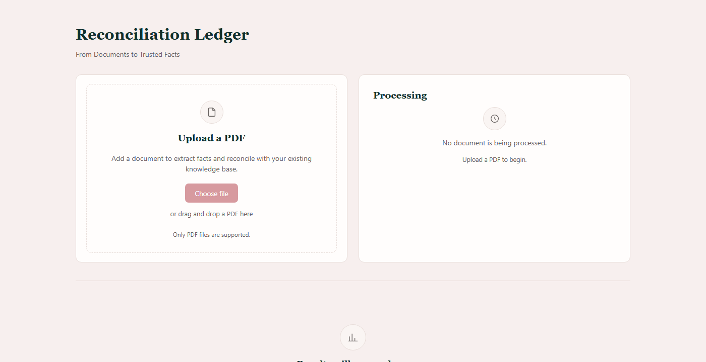
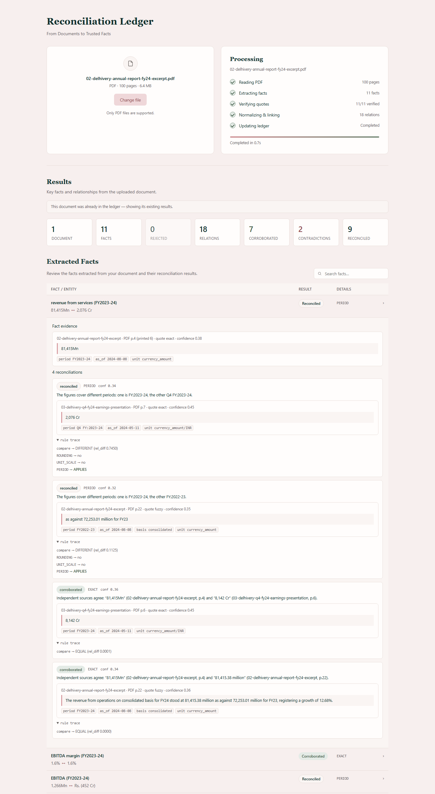

# Reconciliation Ledger

A fact knowledge layer for PDFs. It extracts numeric and semantic facts, ties every
fact to a verbatim quote in its source, and works out where facts across documents
agree, contradict, or only appear to contradict because of context such as period,
units, scope, or the vintage of an estimate.

The reconciliation logic is deterministic and produces an explicit trace for every
decision. A language model is used only to propose candidate facts from text; it never
decides whether two facts agree.

## The problem

Facts are spread across filings and reports and written inconsistently. The same
number appears as `8,142 Cr` and `81,415.38 million`. A director is active in a 2022
prospectus and resigned in a 2024 report. Two institutions publish `6.4%` and `6.5%`
GDP growth for the same year because one figure is a first advance estimate and the
other is provisional.

The task: extract meaningful facts from PDFs, link each to evidence in its source, and
identify when facts corroborate, contradict, or can be reconciled through context,
with a simple API or UI to upload PDFs and inspect the results, and no dependence on
hard-coded facts, filenames, schemas, or per-document rules.

## How it works

```
PDF
 |  parse         PyMuPDF page text and layout blocks, one page at a time
 |  chunk         blocks grouped into small chunks, never spanning a page
 |  extract       model proposes candidate facts, each with a verbatim quote
 |  quote guard   re-find the quote in the source; on failure the fact is rejected
 |  normalise     deterministic: units, sign, footnote markers, fiscal periods,
 |                estimate vintage and as-of date, entity and attribute keys
 |  store         SQLite; identical facts de-duplicated by content hash
 |  block         group by (entity, attribute)
 |  reconcile     deterministic ordered rule cascade, with a recorded trace
 v
 ledger  ->  web UI  /  JSON API  /  engineering view
```

Comparison and the rule cascade are pure Python with unit tests. When two facts about
the same entity and attribute disagree, the first rule that fits decides the outcome:

| Rule | Explains the difference as |
| --- | --- |
| `ROUNDING` | values that agree to three significant figures |
| `UNIT_SCALE` | a 10^n unit convention normalisation missed |
| `PERIOD` | different fiscal periods (FY24 vs Q4 FY24 vs FY23) |
| `TEMPORAL_STATUS` | a status that changed between two filing dates |
| `ESTIMATE_VINTAGE` | the same figure at a different estimate vintage or as-of date |
| `SCOPE` | segment vs total, including vs excluding a component |
| `BASIS` | pro forma vs restated, adjusted vs reported, real vs nominal |
| `IDENTIFIER_REVISION` | an identifier that changed only a format or prefix character |
| `ATTRIBUTION` | one figure is quoted from a third party, not independent agreement |
| none | a contradiction if both facts are confident, otherwise unresolved |

Confidence is carried through the pipeline. Facts from slide decks and dense tables
start lower, and a low-confidence difference with no explaining rule is left
unresolved rather than reported as a contradiction.

## Setup and Run Instructions

Requires Python 3.11 or newer.

```bash
git clone https://github.com/peehu-k/reconcilation-ledger.git
cd reconcilation-ledger
python -m venv .venv
. .venv/bin/activate          # Windows: .venv\Scripts\activate
pip install -e .
```

### Run offline (no model, no keys)

The repository ships six public documents in `sample-pdfs/` and hand-verified
extractions for them, so the whole pipeline and all four cases can be seen without a
running model. Every replayed fact still carries a verbatim quote that is re-checked
against the parsed PDF at ingest time.

```bash
rlx reset
rlx ingest-dir sample-pdfs --provider replay
rlx serve
```

Open `http://127.0.0.1:8000/`, choose a PDF, and inspect the results. Reloading
returns to the empty upload state; it does not reload old data.

### Run with live local extraction

```bash
ollama pull qwen2.5:7b-instruct     # phi3 works as a lighter fallback
RLX_PROVIDER=ollama rlx serve
```

Upload any PDF. On CPU a 7B model takes one to a few minutes per chunk. Ingestion is
resumable: if it is interrupted, or the model becomes unavailable, run the same
command again and it continues from the last processed chunk.

### Command line

```
rlx ingest-dir DIR             ingest every PDF under a directory
rlx ingest FILE                ingest one PDF
rlx reconcile                  rebuild all pairwise relations
rlx stats                      print counts
rlx serve [--host --port]      run the API and web UI
rlx reset                      drop and recreate the database
```

### Tests

```bash
pytest                 # unit, golden fixtures (offline), integration on sample-pdfs
pytest tests/unit      # deterministic core only, about one second
```

## Using the web UI

A fresh page load shows only the upload card, with no data from a previous run.



After a `POST /documents` request completes, the page shows the processing summary,
statistics read from the database, and the document's facts. Expanding a row shows the
verbatim quote with its page, and for each relationship the counterpart evidence and
the full comparison trace.



Main endpoints: `POST /documents`, `GET /documents/{id}/summary`, `GET /facts?doc={id}`,
`GET /relations?doc={id}`, `GET /report` (denser view across all documents).

## Video Demo


## Approach

The model proposes; deterministic code decides. The extractor reads a chunk of text
and returns facts that are explicitly stated, each with a quote copied from the text.
It does not compute, convert, or judge. Everything after that, the comparison and the
whole rule cascade, is plain Python with unit tests and a recorded trace, so the
system stays explainable and a weaker model lowers extraction recall without
corrupting the logic.

Nothing enters the ledger unverified. Each proposed quote is searched for in the
parsed source; a fact whose quote cannot be located is written to a rejected table and
never becomes part of the knowledge layer. This is the main defence against a model
inventing a value or misquoting a scrambled table.

Reconciliation is framed as explanation, not detection. Most differences between
reputable documents have a reason, so the system runs an ordered set of rules that
each try to name it (a different period, basis, estimate vintage, and so on). Only a
difference that no rule explains, and that both sides are confident about, is a
contradiction. Estimate vintage is a first-class axis: the normaliser reads phrases
like "first advance estimates" and attaches an as-of date, so "6.4% vs 6.5% GDP
growth for the same year" becomes one figure seen at two vintages.

There is no fixed list of attributes. Keys are derived lexically, folded through a
small vocabulary of common terms, and linked at runtime by fuzzy matching. Storage is
a single SQLite file; comparison is grouped on `(entity, attribute)` so it never
becomes quadratic. A graph database was not used because the work is grounding,
comparing, and explaining facts, which does not need one.

AI tools: I used Claude (via the Claude Code CLI) to research the problem and generate
much of the implementation and test code, working from an architecture and constraints
I set first. The judgement calls are mine: keeping the reconciliation logic
deterministic behind a unit-tested boundary, the quote guard that rejects unverifiable
facts, framing reconciliation as explanation, adding estimate vintage as an axis, and
validating all four cases against the real starter PDFs rather than trusting generated
output. Cut scope where it added fragility (no graph database, no schema
auto-evolution). Separately, the running system uses a local open model (via Ollama)
or Gemini's free tier for the single job of proposing candidate facts.

### Trade-offs

Precision over recall in extraction: a small set of well-grounded facts is more useful
than a large noisy one, and the quote guard enforces that. The rule cascade is
transparent but hand-built, so a genuinely novel reconciliation axis needs a new rule.
Confidence for slide-deck and table facts is deliberately low, which shows up as
low-confidence relationships rather than hidden errors.

## Handling scale

Parsing is streamed one page at a time, so memory is bounded by a single page.
Extraction is chunked and each chunk is checkpointed, so a long run can be stopped and
resumed. Blocking keeps cross-document comparison proportional to the number of facts
that share an entity and attribute, not to the total. Adding a document extracts only
that document and builds only the relationships that involve its new facts; existing
relationships are not recomputed, and re-uploading a known file is a no-op. The
attribute and entity registries are append-only, so a new kind of fact is a new row
with no migration. Tested on the 100-page filings in the sample set; a larger document
takes longer but works the same way.

## Results

Ingesting the six bundled documents with `--provider replay`: 6 documents, 28 facts,
33 relationships (13 corroborated, 2 contradictions, 18 reconciled, 0 unresolved), and
1 proposal rejected because its quote could not be verified.

| Case | Example from the bundled documents |
| --- | --- |
| Corroboration | Delhivery FY24 revenue: `8,142 Cr` (earnings deck) and `81,415.38 million` (annual report), normalised to the same magnitude. The registered office address also corroborates across the 2022 prospectus and 2024 annual report despite different wording. |
| Contradiction | Corporate office PIN code: `122002` (prospectus and annual report) vs `122001` (annual report responsibility section). Same street address, one digit apart, no rule explains it. |
| Reconciled by context | India GDP growth FY25: `6.4%` (Economic Survey, first advance estimate) vs `6.5%` (RBI, provisional), reconciled by estimate vintage. Forex reserves reconciled by as-of date across three institutions. Revenue `8,142 Cr` (FY24) vs `2,076 Cr` (Q4 FY24), reconciled by period. A director active in 2022 and resigned in 2024, reconciled by time. A CIN with a `U` prefix in 2022 and `L` in 2024, reconciled as a listing-status change. |
| Extraction failure | A proposed "net profit of Rs 5 Cr for FY24" whose quote is not in the deck is rejected and never stored. A figure written without a sign ("Loss for the year ... 2,491.86 million") is flagged by a sanity check and held for review rather than recorded as positive. |

Tests: 120 passing (94 unit, 17 golden fixtures offline, 9 integration on the sample
PDFs). The integration suite checks that every stored fact has a re-verifiable quote,
that the four cases are present, that re-uploading is a no-op, that incremental
ingestion leaves existing relationships untouched, and that the pipeline survives the
model being unavailable or returning malformed output.

## Limitations and Next Steps

Live local extraction is slow on CPU, which is why the offline replay path and
resumable ingestion exist. Slide-deck tables are where a live model most often
misquotes; those proposals are rejected by design, so recall there is low. Entity
resolution is lexical plus fuzzy matching, so a full company rename would need manual
linking. Evidence is shown as page text and a quote; stored bounding boxes are not yet
rendered as highlights. There is no OCR, so scanned PDFs are out of scope. A
reconcilable pair can surface as a contradiction if the model misses a qualifier that
sits far from its number, though the pair still appears with its evidence.

Next: render highlighted evidence from the stored bounding boxes; enable the embedding
cache by default; a work queue for very large PDFs; a small model to suggest which
reconciliation axis applies, still adjudicated deterministically.

## Repository layout

```
rlx/
  ingest/       PDF parsing, chunking, document registry, resumable jobs
  extract/      extraction schema and prompt, quote guard, providers
  normalize/    deterministic units, sign, footnotes, periods, vintage, entities, sanity
  match/        blocking, registry linking, optional embeddings
  reconcile/    compare, ordered rule cascade, confidence (pure, unit-tested)
  store/        SQLite schema and access
  api/          FastAPI app, web UI, engineering views
  pipeline.py   end-to-end orchestration
  cli.py        command line entry point
tests/          unit, golden fixtures, offline integration
sample-pdfs/    six public documents used by the tests and the demo
sample-output/  JSON dumps of the ledger for the bundled documents
docs/           architecture notes, screenshots
```

## Additional Notes

The bundled documents are public: Delhivery filings (prospectus, FY24 annual report,
Q4 FY24 earnings presentation) and macroeconomic reports (India Economic Survey
2024-25, RBI Annual Report 2024-25, IMF India 2025 Article IV). `sample-output/` has
JSON dumps of the ledger for these, including each case with both quotes and the full
rule trace, so the output can be reviewed without running anything. No credentials are
required or stored; `.env.example` lists every setting. `docs/ARCHITECTURE.md` has the
module map and data model in more detail.
